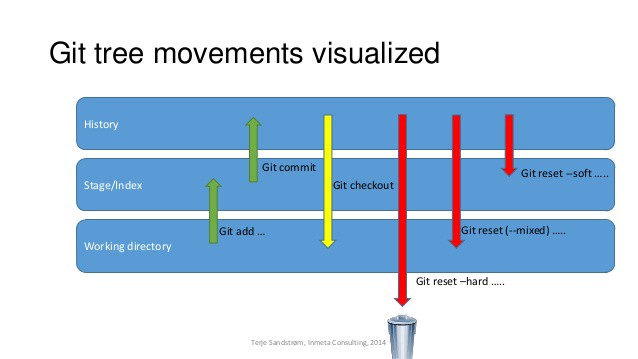

# Terminal / Bash Shell

- / - root
- cd – change directory/folder
- ls – list [ file, folder in current directory ]
- cd ~ - Home directory
- mkdir – make directory
- rm – remove file only
- rm -rf – remove directory
- touch – will create file, eg – touch file.csv
- In powershell (Windows Machine) – echo $null >> file.csv

### Sourced from [Link here](https://github.com/joshnh/Git-Commands), With additional commands, I find helpful.

### Git Documentation Reference: [Link](https://git-scm.com/docs)

# Git Commands

## Getting & Creating Projects

| Command                                                           | Description                                |
| ----------------------------------------------------------------- | ------------------------------------------ |
| `git init`                                                        | Initialize a local Git repository          |
| `git clone ssh://git@github.com/[username]/[repository-name].git` | Create a local copy of a remote repository |

## Basic Snapshotting & Traversing

| Command                                       | Description                                               |
| --------------------------------------------- | --------------------------------------------------------- |
| `git status`                                  | Check status                                              |
| `git add [file-name.txt]`                     | Add a file to the staging area                            |
| `git add -A` or `git add .`                   | Add all new and changed files to the staging area         |
| `git commit -m "[commit message]"`            | Commit changes                                            |
| `git commit -a -m "[commit message]"`         | Commit changes - Tracked files only                       |
| `git rm -r [file-name.txt]`                   | Remove a file (or folder)                                 |
| `git checkout [commit ID]`                    | Traverse between previous commits                         |
| `git checkout master`                         | To go back to latest commit                               |
| `git revert [commit ID]`                      | Goes back to one commit at a time                         |
| `git reset --hard/--soft/--mixed [commit ID]` | Goes back to commit based on ID (Use Cautious using this) |

##### Image source: [link](https://miro.medium.com/max/638/1*Z4DotRF7nQj6RZHpHHJTWw.jpeg)

## Inspection & Comparison

| Command                                    | Description                    |
| ------------------------------------------ | ------------------------------ |
| `git log`                                  | View changes                   |
| `git log --summary`                        | View changes (detailed)        |
| `git log --oneline`                        | View changes (briefly)         |
| `git diff [source branch] [target branch]` | Preview changes before merging |

## Branching & Merging

| Command                                              | Description                                             |
| ---------------------------------------------------- | ------------------------------------------------------- |
| `git branch`                                         | List branches (the asterisk denotes the current branch) |
| `git branch -a`                                      | List all branches (local and remote)                    |
| `git branch [branch name]`                           | Create a new branch                                     |
| `git branch -d [branch name]`                        | Delete a branch                                         |
| `git push origin --delete [branch name]`             | Delete a remote branch                                  |
| `git checkout -b [branch name]`                      | Create a new branch and switch to it                    |
| `git checkout -b [branch name] origin/[branch name]` | Clone a remote branch and switch to it                  |
| `git branch -m [old branch name] [new branch name]`  | Rename a local branch                                   |
| `git checkout [branch name]`                         | Switch to a branch                                      |
| `git checkout -`                                     | Switch to the branch last checked out                   |
| `git checkout -- [file-name.txt]`                    | Discard changes to a file                               |
| `git merge [branch name]`                            | Merge a branch into the active branch                   |
| `git merge [source branch] [target branch]`          | Merge a branch into a target branch                     |
| `git stash`                                          | Stash changes in a dirty working directory              |
| `git stash clear`                                    | Remove all stashed entries                              |

## Sharing & Updating Projects

| Command                                                                           | Description                                                 |
| --------------------------------------------------------------------------------- | ----------------------------------------------------------- |
| `git push origin [branch name]`                                                   | Push a branch to your remote repository                     |
| `git push -u origin [branch name]`                                                | Push changes to remote repository (and remember the branch) |
| `git push`                                                                        | Push changes to remote repository (remembered branch)       |
| `git push origin --delete [branch name]`                                          | Delete a remote branch                                      |
| `git pull`                                                                        | Update local repository to the newest commit                |
| `git pull origin [branch name]`                                                   | Pull changes from remote repository                         |
| `git remote add origin ssh://git@github.com/[username]/[repository-name].git`     | Add a remote repository                                     |
| `git remote set-url origin ssh://git@github.com/[username]/[repository-name].git` | Set a repository's origin branch to SSH                     |
